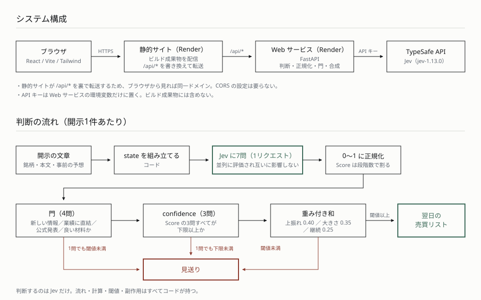

# jev_app — 適時開示から翌日の売買リストを作る

TypeSafe の System One モデル **Jev** を使い、企業の適時開示（決算短信・業績予想の修正など）の
文章を読んで「翌営業日の売買リストに入れるか」を判断するアプリです。

Jev は文章を生成しません。渡した情報に対して、型の付いた判断を確率つきで返します。
このアプリでは、**判断だけをモデルに任せ、流れ・計算・閾値はコードが持ちます。**

デモ： https://jev-frontend.onrender.com/

> 画面に出ている材料は**架空の企業・架空の開示**です。表示している確率は実測値ですが、
> リターンなどの数字はデモ用の架空データで、投資助言ではありません。

## 判断の形

開示1件につき、7つの質問を **1リクエストにまとめて** 投げます（質問どうしは並列に評価され、
互いに影響しません）。返ってきた値をコードが次の順で処理します。

```
門（4問）      新しい情報か／業績に直結するか／公式発表か／良い材料か
   ↓ すべて閾値以上なら
confidence     Score で聞いた3問の confidence が下限以上か
   ↓
合成           予想に対する上振れ 0.40 ＋ 影響の大きさ 0.35 ＋ 影響が続くか 0.25
   ↓ 閾値以上なら
翌日の売買リストに入れる
```

- Noul は 0〜1 の確率、Score は段階の期待値（3段階なら 0〜2）を返すため、
  受け取った直後に **0〜1 へ正規化** してから合成します。
- confidence が返るのは Score の3問だけです（Noul には返りません）。
- 閾値は質問ごとに別の変数として持ちます。値は暫定で、評価フェーズで調整します。

質問文と閾値は [backend/app/questions.py](backend/app/questions.py) の1ファイルに集約しています。

## 構成図



## Jev の得手不得手（実験で測ったこと）

アプリを作る前に、株の題材で27項目の実験を行い、何が任せられて何が任せられないかを測りました。
以下はその要点です。数字はすべて実測で、詳細は [notes/phase1-summary.md](notes/phase1-summary.md) にあります。

- **事実を読む質問は堅く、評価を聞く質問は動く。** 「営業損益は赤字か」「新しい事実を伝えているか」は、
  表面と中身がずれた文でも婉曲な文でも 0.93〜0.98 で正しく答えました。一方、同じ事実を言い換えただけで
  「どれくらい前向きか」は 0.94 → 0.48 に変わりました。**評価の質問は、事実の質問で守る**必要があります。
- **中間の置き場があれば使い、無ければどちらかに倒れる。** 同じ材料（売上は過去最高だが営業赤字）に対し、
  Noul で聞くと 0.19、3段階の Score で聞くと 0.78。分類でも、「該当なし」を入れないと本社移転のニュースを
  「人事」に分類しました（入れれば正しく「該当なし」）。
- **広い問いは、材料が揃っていても答えを潰す。** 「この先上がりそうか」は 0.58（どちらとも言えない）。
  同じ材料を3問に分けると 0.98 / 0.28 / 0.39 と、どれも判断に使える値が返りました。
- **質問は安く、state は高い。** 質問を1つ足すのは約37トークン、銘柄を1つ足すのは約120トークン。
  3問をまとめて投げると、1問ずつ分けるより 2.3倍安く、答えは変わりませんでした。
- **同じ入力でも 0.02〜0.03 ぶれる。** 5回ずつ投げて確かめました。閾値は値の分布から 0.05 以上離して置きます。
- **confidence は3つの合図になる。** 当てはまる選択肢がない（0.63）、材料が割れている（0.67）、
  文体のせいで判断がつかない（0.27）。いずれも「自動で実行してよいか」の分岐に使えます。
- **日本語で困らなかった。** 事実の抽出は日英で同じ値。「上方修正」「減損損失」「特別損失」などの用語も
  正しく読めました（4問とも正解）。ただし1つの材料・1回の実行での観察です。

## 構成

```
backend/      FastAPI。Jev の呼び出し、正規化・門・合成（Render の Web サービス）
frontend/     Vite + React + TypeScript + Tailwind（Render の静的サイト）
evaluation/   判断の検証と評価。門の検証、集計パイプライン
experiments/  フェーズ1の素振り。Jev の得手不得手を27項目で測った記録
notes/        決定事項、実験結果の読み解き、判断設計
render.yaml   Render の Blueprint（Web サービス＋静的サイト、/api/* の転送）
```

静的サイト側の書き換えルールで `/api/*` を Web サービスへ転送しているため、
ブラウザから見れば同一ドメインになり、CORS の設定は要りません。
API キーは Web サービスの環境変数にだけ置き、フロントには出しません。

## 動かす

```bash
# backend（http://127.0.0.1:8000）
cd backend && uv run uvicorn app.main:app --port 8000 --reload

# frontend（http://localhost:5173）
cd frontend && npm run dev
```

`.env` にキーを置きます（リポジトリには含めません）。

```
TYPESAFE_API_KEY=...
```

## 評価

```bash
# 判断の検証（架空の開示16件を Jev に投げる）
uv run python evaluation/run_gate_check.py

# 集計（調整期間）
uv run python evaluation/run_evaluation.py --period tuning --source demo
```

検証期間は `--period holdout --confirm-holdout` を明示したときだけ実行でき、
一度実行すると再実行を拒否します。閾値を調整しながら検証期間を覗くことを、
仕組みとして防ぐためです。

## リポジトリに含めないもの

| 対象 | 理由 |
|---|---|
| `.env` | API キー |
| `evaluation/results/`、`backend/data/real/` | 本番データと、そこから作った加工データ。J-Quants は取得データそのものの再配布を禁止しています（集計結果の公開は可） |
| `.claude/skills/` | 第三者の skill。下記のとおり、ライセンス表記のないものが含まれるため |

デモ用の架空データ（`backend/data/demo.json`、`backend/data/evaluation.demo.json`）は
本番と名前を分けたうえで含めています。

## 作るときに使った AI の skill

コードは筆者が設計し、Claude Code と対話しながら書いています。
画面を作る際、次の3つを使いました（リポジトリには含めていません）。

| skill | 出所 | 導入 |
|---|---|---|
| frontend-design | Anthropic 公式プラグイン（`claude-plugins-official`、version `fa59bc903774`） | `claude plugin install frontend-design@claude-plugins-official` |
| web-design-guidelines | [vercel-labs/agent-skills](https://github.com/vercel-labs/agent-skills) | 下記 |
| vercel-composition-patterns | [vercel-labs/agent-skills](https://github.com/vercel-labs/agent-skills)（MIT） | 下記 |

```bash
npx skills add vercel-labs/agent-skills \
  --skill web-design-guidelines --skill vercel-composition-patterns --agent claude-code
```

2026年9月28日に導入。そのときの `vercel-labs/agent-skills` の最新コミットは `063bee94c3f4`
（2026-08-28）です。導入した skill のハッシュは [skills-lock.json](skills-lock.json) にあります。

`vercel-labs/agent-skills` にはリポジトリ全体の LICENSE がなく、
`web-design-guidelines` にはライセンス表記がありません
（`vercel-composition-patterns` は SKILL.md に MIT と明記）。そのため両方とも
リポジトリには含めず、導入コマンドだけを残しています。

## 記録

各フェーズで決めたことと、実験で分かったことは `notes/` にあります。

- [notes/decisions.md](notes/decisions.md) — 決定事項と未決の論点
- [notes/decision-design.md](notes/decision-design.md) — 7問の設計と合成の形
- [notes/phase1-summary.md](notes/phase1-summary.md) — Jev の得手不得手（27実験の総括）
- [notes/results/](notes/results/) — 実験ごとの読み解き
